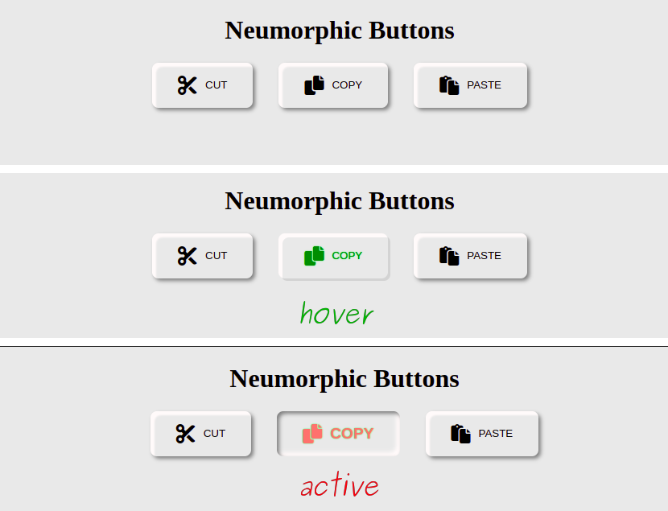

# Neumorphic Buttons

**[Take a look at these buttons](https://saby-gaby.github.io/neumorphic-btns/)**

---

## About Project

- Neumorphic buttons styling with only HTML and CSS.

## How to use this Project

- You can see the final product or view its code.

## Developed With

- [x] _HTML5_
- [x] _CSS#_
- [x] _git_

## Contact

Mail: <sgudzenova@gmail.com> 
GitHub: [saby-gaby](https://github.com/saby-gaby) 
LinkedIn: [Sabina Gudzenova](https://www.linkedin.com/in/sabina-gudzenova-3a8753234/)

---

## Used Tools

- [Font Awesome](https://www.colorzilla.com/chrome/)
- [Visual Studio Code](https://code.visualstudio.com/)
- [Krita](https://krita.org/en/)
- [flexbox](https://developer.mozilla.org/en-US/docs/Learn/CSS/CSS_layout/Flexbox)
- [box-shadow](https://developer.mozilla.org/en-US/docs/Web/CSS/box-shadow)
- [text-shadow](https://developer.mozilla.org/en-US/docs/Web/CSS/text-shadow)
- [transition](https://developer.mozilla.org/en-US/docs/Web/CSS/transition)

---

### Have a nice and sunny day! 🌞
